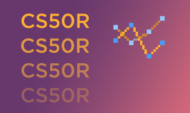

# CS50’s Introduction to Programming with R

Before reading the files in this repository, please remember the [Academic Honesty](https://cs50.harvard.edu/r/2023/honesty/).\
These files serve to give you a sense of how to solve the problems **if** you feel lost.\
Do not copy and paste any of these files. Try to solve the problems yourself!

## Submissions

* **[Representing Data](week1)**
   - [art.frame](week1/art.frame)
   - [Big 5](week1/big5)
   - [Pit Stop](week1/pitstop)

* **[Transforming Data](week2)**
   - [Librarian](week2/librarian)
   - [On Time](week2/ontime)
   - [Teahouse](week2/teahouse)

* **[Applying Functions](week3)**
   - [Happy](week3/happy)
   - [PDX Carpet](week3/carpet)
   - [Variations](week3/variations)

* **[Tidying Data](week4)**
   - [Northwest Air](week4/air)
   - [Zeruda no Densetsu](week4/zelda)

* **[Visualizing Data](week5)**
   - [Exploratory Data Analysis](week5/eda)
   - [Parked Out By The Lake](week5/parked)

* **[Testing Programs](week6)**
   - [Can You Believe in Machines?](week6/believe)
   - [Measure Twice](week6/measure)

## Certificate

