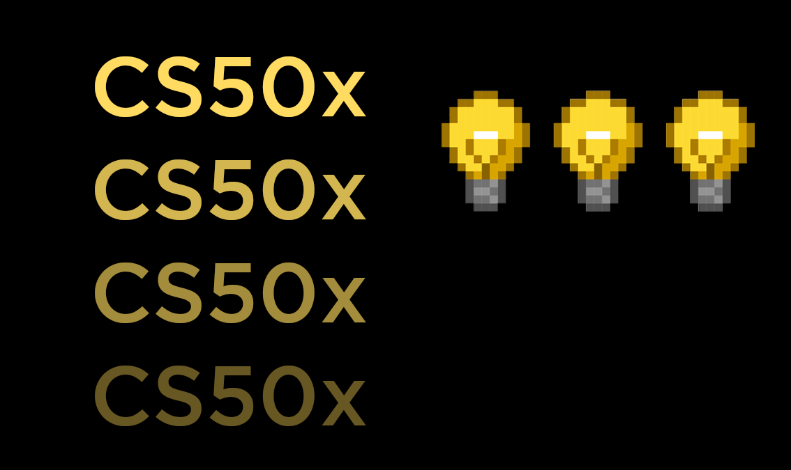

# CS50x - Introduction to Computer Science

Before reading the files in this repository, please remember the [Academic Honesty](https://cs50.harvard.edu/x/2025/honesty/).\
These files serve to give you a sense of how to solve the problems **if** you feel lost.\
Do not copy and paste any of these files. Try to solve the problems yourself!

## Problem Sets

* **[Pset 1 - C Basics](pset01)**
   - [Cash](pset01/cash)
   - [Credit](pset01/credit)
   - [Mario (Less)](pset01/mario-less)
   - [Mario (More)](pset01/mario-more)
   - [Me](pset01/me)
   - [World](pset01/world)

* **[Pset 2 - Arrays and Strings](pset02)**
   - [Caesar](pset02/caesar)
   - [Readability](pset02/readability)
   - [Scrabble](pset02/scrabble)
   - [Substitution](pset02/substitution)

* **[Pset 3 - Algorithms](pset03)**
   - [Plurality](pset03/plurality)
   - [Runoff](pset03/runoff)
   - [Sort](pset03/sort)
   - [Tideman](pset03/tideman)

* **[Pset 4 - Memory](pset04)**
   - [Filter (Less)](pset04/filter-less)
   - [Filter (More)](pset04/filter-more)
   - [Recover](pset04/recover)
   - [Volume](pset04/volume)

* **[Pset 5 - Data Structures](pset05)**
   - [Inheritance](pset05/inheritance)
   - [Speller](pset05/speller)

* **[Pset 6 - Python](pset06)**
   - [DNA](pset06/dna)
   - [Sentimental - Cash](pset06/sentimental-cash)
   - [Sentimental - Credit](pset06/sentimental-credit)
   - [Sentimental - Hello](pset06/sentimental-hello)
   - [Sentimental - Mario (Less)](pset06/sentimental-mario-less)
   - [Sentimental - Mario (More)](pset06/sentimental-mario-more)
   - [Sentimental - Readability](pset06/sentimental-readability)

* **[Pset 7 - SQL](pset07)**
   - [Fiftyville](pset07/fiftyville)
   - [Movies](pset07/movies)
   - [Songs](pset07/songs)

* **[Pset 8 - Web Development](pset08)**
   - [Homepage](pset08/homepage)
   - [Trivia](pset08/trivia)

## Certificate

